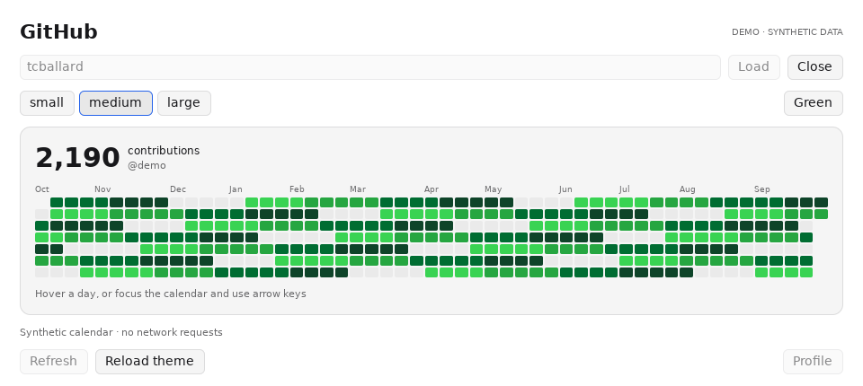

# GitHub Contributions · MyGo experiment


The GitHub contribution widget rendered by **MyGo's native Go UI**. This is an
independently launched comparison window, with the existing QML widget left intact.
MyGo is pinned to **v0.2.11** (`eac977aff4f2b4d50b76ac98b5203efb7630519a`).
No webview, browser frontend, Bun, token or third-party contribution service.



This development experiment has **no live Omarchy acceptance yet**. It is a
normal Wayland application window, not a Widget Core renderer or layer-shell
desktop surface. Core's grants, sandbox, placement, instances and workspace rules
do not apply to this separate process. No migration is performed.

## Try on the XPS

Requires Git, GTK 3 and Go. This module requires Go 1.27.1; a recent Go installation
can download that toolchain automatically. On Arch, install missing prerequisites
with `sudo pacman -S --needed git go gtk3` using your normal package-update policy.

```bash
mygo_sources=$(mktemp -d "$HOME/github-widget-mygo.XXXXXX")
git clone --branch experiment/mygo-github-widget --single-branch \
  https://github.com/tcballard/omarchy-widget-github.git "$mygo_sources/source"
cd "$mygo_sources/source/experiments/mygo"
CGO_ENABLED=0 go build -mod=readonly -tags mygo_noinspector \
  -trimpath -ldflags='-s -w -X github.com/egoist/mygo.production=1' \
  -o "$mygo_sources/github-widget-mygo" .
"$mygo_sources/github-widget-mygo" --username tcballard
```

Keep the printed working directory or the `mygo_sources` variable to run it again.
The native Linux backend needs GTK 3; it does not require WebKitGTK. This command
does not install a service, autostart entry or system-wide package. It writes the
clone and binary in the new directory and uses Go's normal module/build caches.
Use the visible **Close** button or your normal window-close shortcut to quit.

Useful variants, from the same terminal:

```bash
# No network: deterministic synthetic graph, clearly labelled DEMO.
"$mygo_sources/github-widget-mygo" --demo
# Exercise the real request/parser without a desktop window.
"$mygo_sources/github-widget-mygo" --check --username tcballard
# Start in a particular layout/palette.
"$mygo_sources/github-widget-mygo" --username tcballard --size large --palette theme
```

CI also builds `github-widget-mygo-linux-amd64` as a workflow artifact. It is an
experimental build, not a tagged release or an Arch package. Its archive includes
source identity, checksums and dependency licence notices.

After downloading and extracting that artifact on Linux x86_64, run
`sha256sum -c SHA256SUMS`, `chmod +x github-widget-mygo`, then
`./github-widget-mygo --username tcballard` from its directory. GTK 3 is still
required; Go is needed only for a source build.

## What works in the experiment

- Public annual contribution total and calendar; small shows the latest 13 weeks,
  medium the complete year, large the year in two panels.
- Edit the username and press Enter or **Load**. Public profile opens only after
  clicking **Profile**. **Refresh** reuses a successful result for 15 minutes.
- Hover a day for its count/date; click the calendar then use arrows. Left/right
  move by a week; up/down by a day. Tab moves among controls and calendar panels.
- Green or theme accent. The read-only theme adapter consumes six-digit flat hex
  foreground/background/accent/red from
  `$XDG_STATE_HOME/omarchy/current/theme/colors.toml` (default `~/.local/state`).
  **Reload theme** applies changes; no theme polling runs while idle.
- Loading, zero, unavailable and stale are different states. Failed refresh keeps
  the last successful graph **for that account**. Changing account clears it.
- Requests run off the UI thread, with a 45-second timeout, a 512 KiB response
  limit, rejected redirects and cancellation on account replacement or close.
  Closing waits for the canceled worker to finish; old completions are ignored.

The process requests `https://github.com/users/USERNAME/contributions` on startup
and on explicit loads/refreshes, sharing your IP and the chosen username with
GitHub. Standard system proxy settings are respected. The fragment is an
undocumented public endpoint: malformed, incomplete or changed markup produces
an error rather than invented data. Private/signed-in totals can differ.

The experiment corrects one inherited assumption: GitHub's rolling calendar can
include Sunday padding. The live response on 6 October 2026 contained 367 days;
the original Core parser accepted only 365–366. Here, 365–371 contiguous days are
accepted, with a Sunday start required for more than 366. This correction is local
to the experiment; it does not patch your installed Core.

There is no automatic refresh, disk calendar cache or saved account/size/palette.
Options reset at restart; use the CLI flags to repeat a setup. This keeps the
experiment's state separate from the installed widget. No glass effect is applied:
this first slice tests the renderer and real data flow. It makes no claim of
desktop-behind-window blur or lower memory use.

## Compare with the existing widget

1. Run `--demo` first; inspect all sizes, hover/keyboard counts and close/reopen.
2. Run your public username. If it fails, run `--check` and keep its error output.
   A graph succeeding through curl alone does not validate the Go transport.
3. Load another valid account, then a nonexistent account; the old account must
   never appear under the new name. Test offline refresh after the 15-minute cache
   expires: the previous same-account calendar should remain visibly stale.
4. Change Omarchy theme and click **Reload theme**. Compare Green and Accent.
5. Test dragging, resizing, focus, Super+W, workspace changes, mixed display scales,
   suspend/resume and monitor unplugging. No compositor rules are installed.
6. Compare idle CPU/RSS with the QML widget on the same machine, graph size, display
   scale and refresh state. Include Core's renderer/broker processes in its total;
   separate an already-running Core baseline from the incremental widget cost.

For a single process measurement, install `sysstat` if desired and use:

```bash
"$mygo_sources/github-widget-mygo" --demo &
mygo_widget_pid=$!
pidstat -u -r -p "$mygo_widget_pid" 1 30
```

Keep the window idle while sampling. Repeat with the real graph after loading.
`MYGO_FRAME_STATS=1` prints slow-frame diagnostics; `MYGO_GPU=0` forces CPU drawing
and `MYGO_GPU=1` forces Linux OpenGL. Use the default for the primary comparison.
There are no performance measurements from the XPS yet.

## Development and removal

```bash
go test ./...
go vet ./...
CGO_ENABLED=0 go build -tags mygo_noinspector -o /tmp/github-widget-mygo .
/tmp/github-widget-mygo --demo --size medium --render /tmp/github-mygo-demo.png
```

Tests exercise native UI controls without a window, calendar coverage/alignment,
malformed markup, endpoint/response bounds, account generations and stale state.
An optional captured fragment can be tested with
`GITHUB_CALENDAR_FIXTURE=/absolute/path/calendar.html go test -run TestCaptured -v`.
Neither synthetic renders nor headless tests establish compositor compatibility.
See [EVIDENCE.md](EVIDENCE.md) for checks actually run.

To remove: close the experiment and delete only the fresh `github-widget-mygo.*`
directory you created. There is no installed service, widget grant, settings or
calendar data to remove. Go's shared caches may be retained. Do not run
`omarchy-widget install` on this comparison checkout after putting compiled
binaries inside it; Core counts all package files towards its 8 MiB limit.
Continue installing the regular widget from its documented release checkout.

MIT, copyright 2026 Tom Ballard. Calendar projection follows the MIT-licensed
Widget Core implementation at `70712a403d6513893c0e4c6c0e9e177dfba646da`;
layout semantics follow this repository's `Model.js` at `41beef6`. MyGo and its
dependencies retain their own licence notices, bundled by CI. GitHub is a
trademark of GitHub, Inc.; this is an unofficial experiment. The App badge is a
community identity label, not official approval.
